# EchoSpace

A simple, modern social messaging platform built with React.

 <!-- Replace with actual banner if you have one -->

## ✨ Features

- **User Authentication**
  - Secure sign up and sign in
  - JWT token implementation for session persistence
  - Admin account setup with special keyword

- **Avatar Selection**
  - Choose from 6 cute pixel-art animal avatars during registration

- **Messaging System**
  - Post public messages with title and content
  - View all messages on the home feed
  - Edit and delete your own messages

- **Membership System**
  - Unlock special features by becoming a member using a passcode

- **User Profile**
  - View and update personal information
  - Change avatar

- **Responsive Design**
  - Clean and intuitive UI with smooth interactions

## 🛠️ Technologies Used

- **Frontend**: React.js, React Router
- **Styling**: CSS (or TailwindCSS / Styled Components - specify if used)
- **Authentication**: JWT (JSON Web Tokens) for secure session management
- **Backend**: (Node.js + Express + MongoDB / PostgreSQL - update accordingly)

## 📸 Screenshots

### Sign Up & Avatar Selection

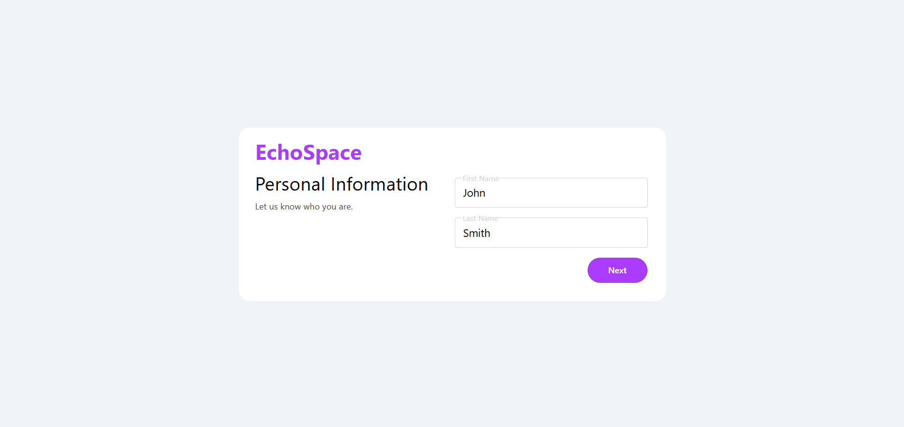
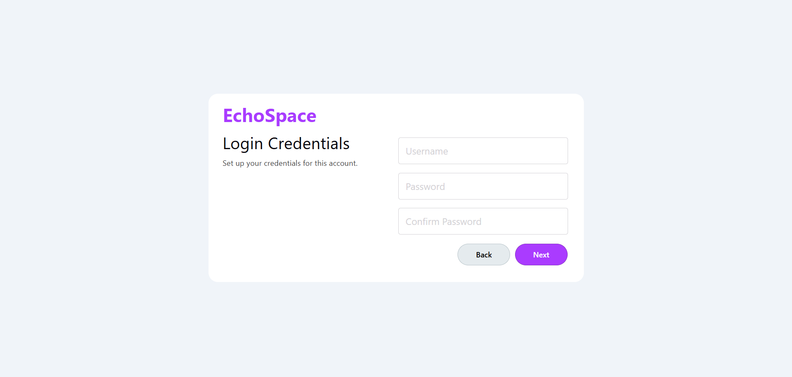
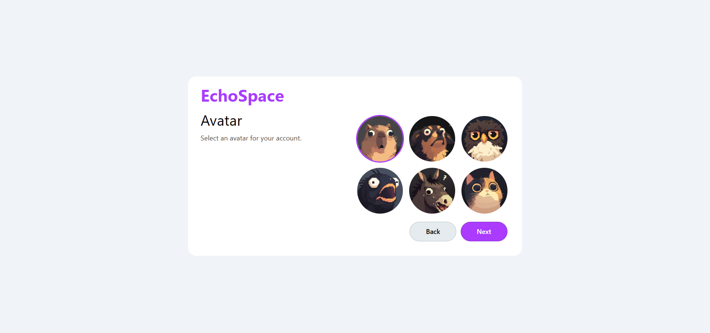
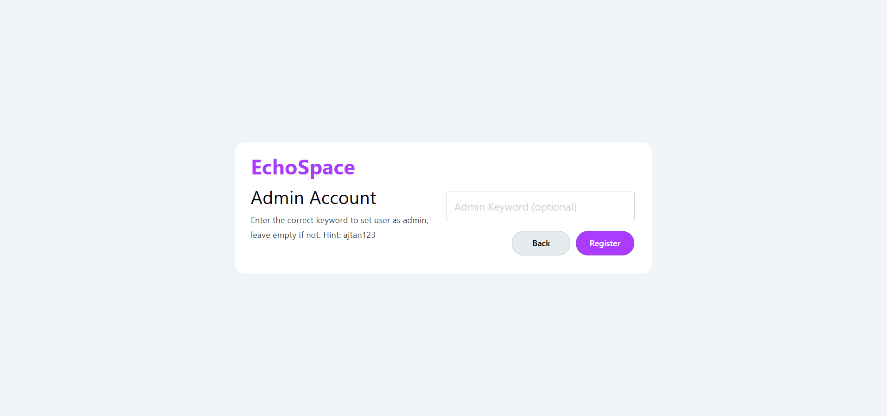

### Home Feed (Signed In)

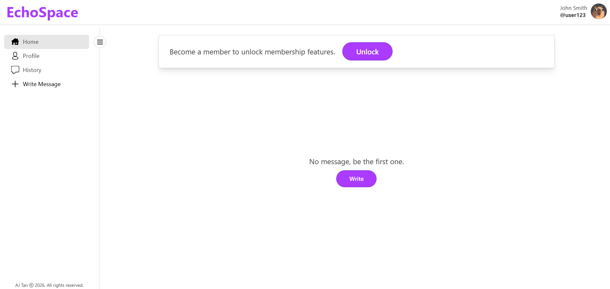
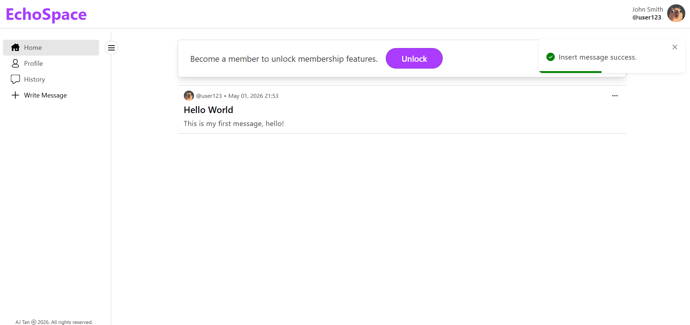

### Posting a Message

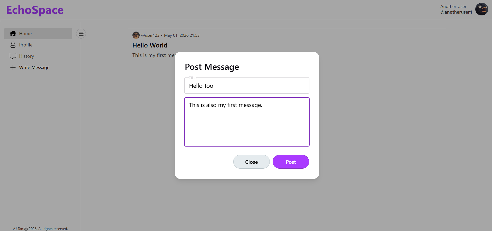

### Profile Page

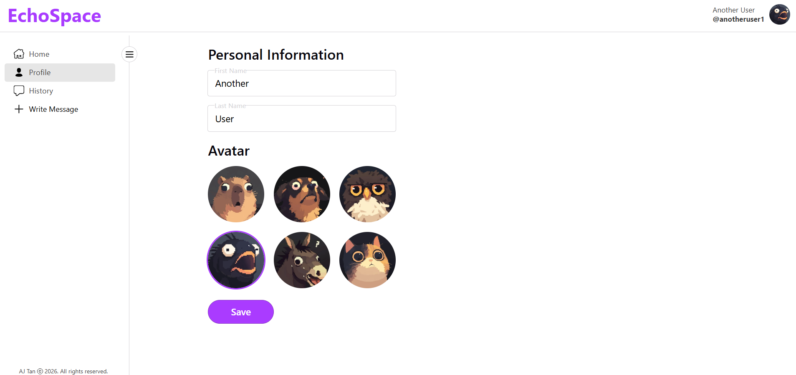

### Membership Unlock

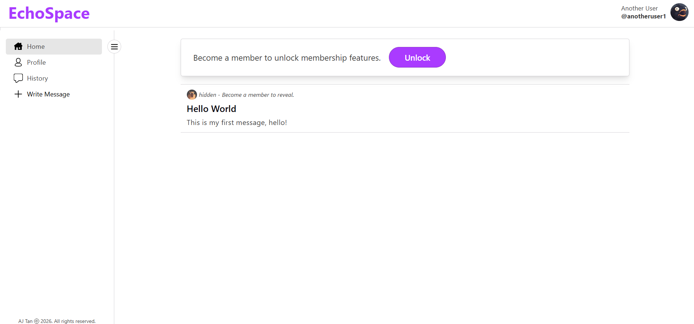
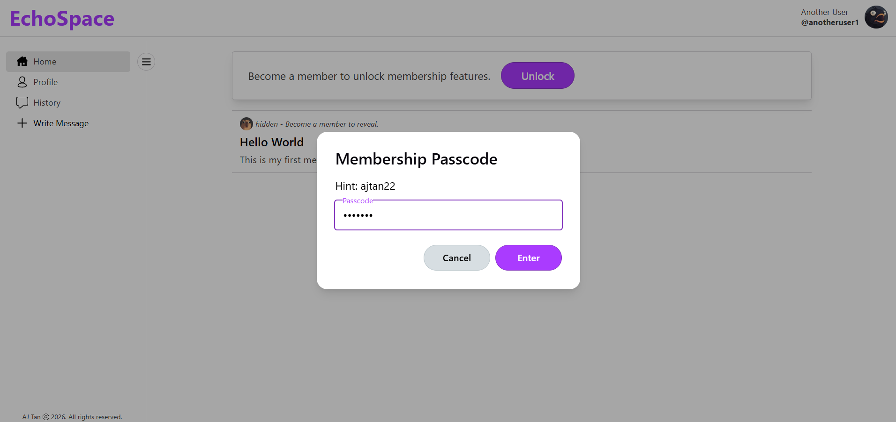
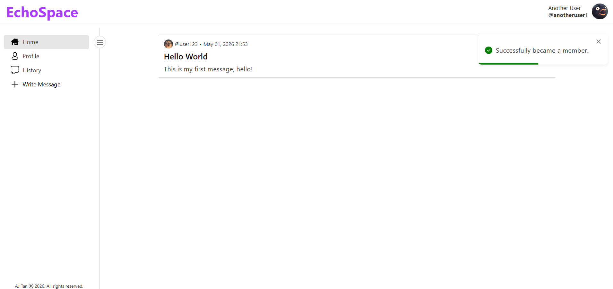

### Message Options (Edit/Delete)

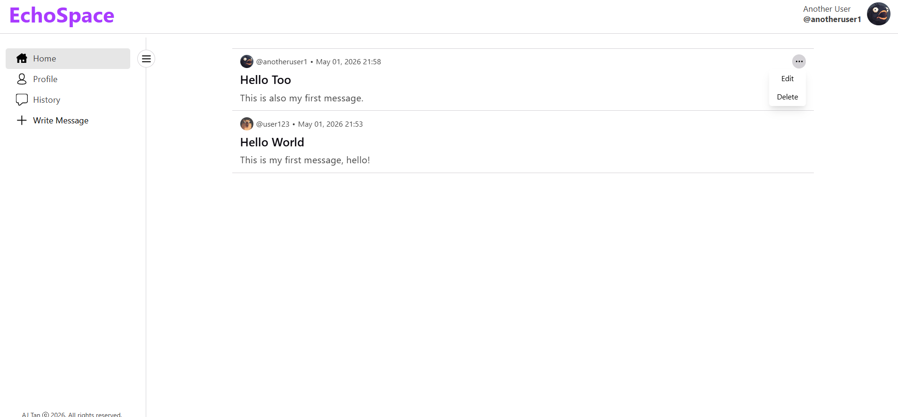

## 🎓 What I Learned from The Odin Project

This project was built while following **The Odin Project** curriculum. Key learning outcomes include:

- Building full-featured React applications with multiple pages and state management
- Implementing secure **JWT-based authentication**
- Persisting user sessions using tokens (stored in localStorage / httpOnly cookies)
- Handling protected routes and conditional rendering
- Creating modal interfaces and form validations
- Managing user-generated content (CRUD operations for messages)
- Designing clean, user-friendly interfaces

## 🚀 Getting Started

### Prerequisites

- Node.js (v18 or higher)
- npm or yarn

### Installation

1. Check Frontend and Backend folder readme for details.
